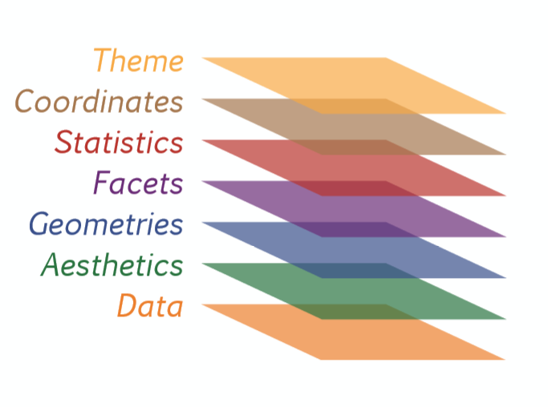
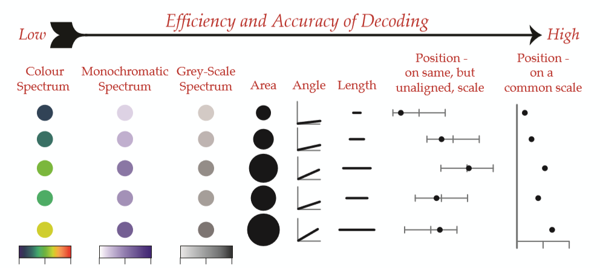
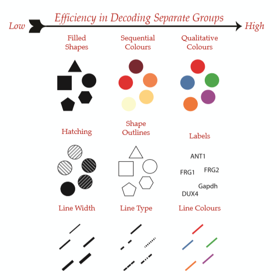

```{r setup, include=FALSE}
library(ggplot2)
library(dplyr)
library(knitr)
library(tidyr)
options(scipen = 999)
anscombe_tidy <- anscombe %>% gather() %>%
  separate(col = key, c('variavel', 'conjunto'), sep = 1) %>%
  group_by(variavel) %>% mutate(row = 1:n()) %>%
  spread(variavel, value) %>% select(-row)

dados <- readRDS('pam2.RDS')
```

## Visualização de dados 

```{r, echo = FALSE, warning = FALSE}
ggplot(dados, aes(cultura, area_variacao)) + 
  geom_violin(aes(fill = cultura), scale = "width") +
  geom_jitter() +
  theme_minimal() + 
  labs(title = "", x = "Variação da área planatada  (1994-2016)", 
       y = "Variação da Produtividade  (1994-2016)", fill = "")
```

---

# A gramática dos gráficos

---

## Quarteto de Anscombe

```{r, echo = FALSE}
kable(anscombe[, c(1,5,2,6,3,7,4,8)])
```

---

## Quarteto de Anscombe

```{r,  echo = FALSE}
ggplot(anscombe_tidy, aes(x,y)) +
  geom_point() +
  geom_smooth(method = "lm", se = FALSE) +
  facet_wrap(~ conjunto, nrow = 2) + theme_bw()
```

---

## Tipos de gráficos

O gráfico é um meio de comunicação e deve ser adequado ao seu público. 
É diferente preparar um **gráfico de apresentação** para apresentar conclusões 
ou fazer um **gráfico exploratório** para você mesmo. Ambos diferem em **público** 
e em **objetivo**.

---

## Concepção do ggplot2

<!-- O ggplot2 é mais do que um pacote para fazer gráficos; ele é uma tentativa 
(muito bem sucedida) trazer para o dia-a-dia dos técnicos uma **gramática dos 
gráficos em camadas**. -->

### Por que uma **gramática** dos gráficos?

Através dela podemos definir **sistematicamente** quais são os componentes de um 
gráfico e como eles se interelacionam.

Veja mais informações em [http://docs.ggplot2.org/](http://docs.ggplot2.org/current/).

---

## A gramática dos gráficos



---

## A gramática dos gráficos

|       elemento       |        exemplos         |
|:--------------------:|:-----------------------:|
|  dados (informação)* |  produção, temperatura  |
|   **(a)es**tética*   |      cor, formato       |
|    **geom**etrias*   |      barra, ponto       |
|    e**stat**ísticas  |    mediana, máximo      |
|     **facet**as      |        facetas          |
|   **coord**enadas    |    polar, cartesiana    |
|     **t(h)emas**     |      eixos, título      |

'* aspéctos estéticos imprescindíveis para criar um gráfico no ggplot2

---

## Sintaxe do ggplot2

```{r, eval = FALSE}
ggplot(um_data_frame, aes(estética1 = variável1,
                  estética2 = variável2,
                  estética3 = variável3)) +
  geometria(estética4 = "atributo1") +
  facetas +
  tema
```

Note que cada função cria uma (ou mais) camadas e que usamos o `+` para ir adicionando camadas.

---

# A camada de dados

---

## Dados

> Atrás de todo gráfico legal existe um data frame organizado.

Para focar em nosso objetivo, vamos trabalhar com um conjunto de dados organizado.
Lembre-se que tabelas do tipo _long_ são mais amigáveis ao ggplot2.

```{r carga}
# importa dados
dados <- readRDS('pam2.RDS')
feijao <- filter(dados, cultura == "Feijão")
# conhecer sua estrutura e campos
str(dados)
```

---

# Aspectos Estéticos

---

## Aspectos Estéticos

Os principais aspectos estéticos são:

Estética | Descrição
----------|----------------------------------------
x | Eixo horizontal
y | Eixo vertical
colour | Cor dos pontos ou das linhas das formas
fill | Cor de preencimento 
size | Diametro dos pontos e espessura das linhas
alpha |Transparência
linetype | Tipo (padrão) da linhas
labels | Texto no gráfico ou nos eixos
shape | Forma

---

## Representando dados

```{r}
ggplot(feijao, aes(x = area_variacao, y = quantidade_variacao)) +
  geom_point()
```

---

## Representando dados

Imagine que você fosse desenhar um gráfico. Como você decidiria até onde deve ir a barra ou onde ficariam os pontos? O computador também precisa de critérios para decidir como representar os dados, como o Valor Bruto da Produção agropecuária (VBP) de uma região, em um gráfico.

Assim, o VBP pode ser representado no eixo vertical ou os faixas de valores podem aparecer como cores ou formas (até R$ 50 milhões: triângulos; entre 50 e 100: quadrados; e maiores que 100: circulos).

---

## Mapeando variáveis em estéticas

É diferente **mapear** uma estética e **atribuir um valor** a um aspecto estético. Mapear uma variável em uma estética é dizer que a cor **vermelha** representa o Centro-Oeste e a cor **azul** o Sudeste. Isto é diferente de definir a cor de pontos ou barras como **verde**. Para poder fazer isso, precisamos carregar o pacote `ggplot2`

`libarry(ggplot2)`

---

## Atributos Estéticos - Atribuir cor à elemento estético

```{r}
ggplot(feijao, aes(x = area_variacao, y = quantidade_variacao)) +
  geom_point(col = "indianred")
```

---

## Aspectos Estéticos - Mapear a cultura na cor

```{r}
ggplot(dados , aes(x = area_variacao,
                    y = quantidade_variacao, col = cultura)) +
  geom_point()
```

---

## Aspectos Estéticos - Mapear VBP no tamanho

```{r}
ggplot(feijao , aes(x = area_variacao, y = quantidade_variacao)) +
  geom_point(aes(size = produtividade_variacao),
             col = "darkgreen", alpha = 0.5)
```

---

## Aspectos Estéticos - Variáveis contínuas

Estética | Descrição
---------|----------------------------------------
x | Eixo horizontal
y | Eixo vertical
colour | Cor dos pontos ou das linhas das formas
fill | Cor de preencimento 
size | Diametro dos pontos e espessura das linhas
alpha | Transparência

---

## Aspectos Estéticos - Variáveis contínuas



Fonte: www.datacamp.com

---

## Aspectos Estéticos - Variáveis contínuas

```{r}
ggplot(feijao, aes(x = area_variacao, y = quantidade_variacao,
                   col = produtividade_variacao)) +
  geom_point(size = 2)
```

---

## Aspectos Estéticos - Variáveis categóricas

Estética | Descrição
----------|----------------------------------------
colour | Cor dos pontos ou das linhas das formas
fill | Cor de preencimento 
size | Diametro dos pontos e espessura das linhas
alpha |Transparência
linetype | Tipo (padrão) da linhas
labels | Texto no gráfico ou nos eixos
shape | Forma

---

## Atributos Estéticos - Variáveis categóricas



Fonte: www.datacamp.com

---

## Aspectos Estéticos - Variáveis categóricas

```{r}
ggplot(dados, aes(x = area_variacao, y = quantidade_variacao,
                   shape = cultura)) +
  geom_point(size = 2)
```

---

## Aspectos Estéticos - Variáveis categóricas

```{r}
ggplot(dados, aes(x = area_variacao, y = quantidade_variacao,
                  col = cultura)) +
  geom_point()
```

---

# Geometrias

Além de ter dados e mapeá-los em atributos estéticos, você deve escolher com que geometrias quer aprensentar seus dados.

As geometrias mais comuns são:

* Pontos (diagrama de dispersão)

* Barras

* Linhas

Vamos ver como usar estas geometrias no `ggplot2`.

---

## geom_point()

```{r geom_point}
ggplot(feijao, aes(x = area_variacao, y = quantidade_variacao)) +
  geom_point()
```

---

## geom_smooth()

```{r}
ggplot(dados, aes(x = area_variacao, y = quantidade_variacao)) +
  geom_point() + 
  geom_smooth(aes(col = cultura), se = FALSE, method = "lm")
```

---

## geom_col() ou geom_bar()

```{r geom_bar}
medias <- dados %>% group_by(cultura) %>%
  summarise(variacao_area = mean(area_variacao, na.rm = TRUE))
```

---

## geom_col() ou geom_bar()

```{r}
ggplot(medias, aes(x = cultura, y = variacao_area)) +
  geom_col() # ou geom_bar(stat = "identity")
```

---

## geom_line() 

```{r geom_line}
# ggplot(PR, aes(Ano, area_plantada)) +
#   geom_line(aes(col = cultura, group = cultura),
#             size = 2)

# Achar exemplo bom com conjunto de dados atual
```

---

## geom_histogram()

```{r geom_histogram, warning=FALSE}
ggplot(dados, aes(x = produtividade_variacao)) +
  geom_histogram(fill = "indianred") # definir intervalos
```

---

## Ou então geom_density()

```{r geom_density}
ggplot(dados, aes(x = produtividade_variacao, fill = cultura)) +
  geom_density(alpha= 0.7)
```

---

## geom_boxplot()

```{r geom_boxplot}
ggplot(dados, aes(x = cultura, y = produtividade_variacao)) +
  geom_boxplot(aes(fill = cultura))
```

---

## ...ou geom_violin()

```{r}
ggplot(dados, aes(x = cultura, y = produtividade_variacao,
               fill = cultura)) +
  geom_violin(draw_quantiles = 0.5)
```

---

## Exercícios

1. Desenhe um gráfico de violino da produtividade com o conjunto de dados a sua escolha. Adicione uma camada representando as observações com pontos. Dê uma olhada em `?geom_jitter`, pode ser útil.

2. Há grande diferença entre a relação área colhida / área plantada entre as regiões? E Entre as culturas? Responda construindo gráficos. Utilize o conjunto `dados` para esta questão.

---

## Exercícios

3. Desenhe um gráfico de dispersão com a produtividade em um eixo e a área plantada em outro. Utilize os dados de produção do feijão. Adicione uma reta de regressão para todo o conjunto de dados. Adicione nova camada com uma regressão para região (utilize a cor para diferenciar os grupos). A regressão geral representa bem a relação entre área e produtividade para os subconjuntos?

Extra: Parta do mesmo gráfico de dispersão anterior (produtividade x área). Tente adiconar mais informações no mesmo gráfico mapeando outras variáveis. Busque identificar em que momento as informações idicionais poluem o gráfico.

---

## Solução 1

```{r}
ggplot(dados, aes(x = cultura, y = produtividade_variacao, 
                   fill = cultura)) +
  geom_violin() +
  geom_jitter()
```

---

## Soluções 2 - a

```{r}
# ggplot(dados) +
#   geom_density(aes(x = area_colhida / area_plantada,
#                    fill = regiao)) +
#   facet_wrap(~regiao)
```

---

## Soluções 2 - b

```{r}
# ggplot(dados, aes(x = cultura,
#                   y = area_colhida / area_plantada)) +
#   geom_point(alpha = 0.4, position = "jitter")
```

---

## Solução 3

```{r, eval = FALSE}
# ggplot(feijao, aes(x = area_plantada,
#                    y = produtividade)) +
#   geom_point() +
#   geom_smooth(aes(col = regiao),method = "lm",
#               se = FALSE, size = 2) +
#   geom_smooth(group = 1, col = "blue",
#               method = "lm", se = FALSE)
```

---

## Solução 3

```{r, echo  = FALSE}
# ggplot(feijao, aes(x = area_plantada,
#                    y = produtividade)) +
#   geom_point() +
#   geom_smooth(aes(col = regiao),method = "lm",
#               se = FALSE, size = 2) +
#   geom_smooth(group = 1, col = "blue",
#               method = "lm", se = FALSE)
```

---

## Extra

```{r diamonds, echo=FALSE}
# ggplot(dados, aes(x = produtividade, y = area_plantada, col = regiao)) +
#   geom_point(aes(size = VBP)) +
#   facet_wrap(~cultura, nrow = 2, scales = "free")
```
