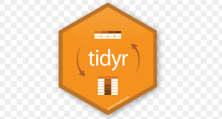

background-image: url(www/slide1.png)
background-size: cover

<link rel="stylesheet" type="text/css" href="enap.css">

---

```{r setup, include=FALSE}
options(htmltools.dir.version = FALSE, max.print = 30, digits = 4)
knitr::opts_chunk$set(fig.align = "center", fig.width = 10, fig.height = 6)
library(tidyverse)
```

# Percurso do curso

<br/>
<br/>

1. [Noções](#13) de **R**

2. Como [importar](#30) os dados?

3. Como [transformar](#35) os dados?

4. Como [visualizar](#75) os dados?


---
# Percurso de hoje

<br/>
<br/>

1. Manipulação de linhas

2. Manipulação de colunas

3. Criar sumários

4. Unir tabelas

5. Pivotear tabelas

---
class: inverse, center, middle

# Como <a>transformar</a> os dados

---
background-image: url(www/data-science.png)
background-size: 100%
class: center

# <a>Ciclo</a> de análise de dados

---
background-image: url(www/pipe.jpg)
background-size: 85%
class: center

---

```{r, include = FALSE}
library(tidyverse)
imdb <- read_rds("dados/imdb.rds")
```


# %>% (pipe)

O <a>pipe</a> está baseado na pintura do artista belga Magritte.

```{r}
valores <- rnorm(10, 10, 2)
mean(abs(diff(valores)))
```

<br>

Vejamos a mesma operação com o <a>pipe</a>

```{r}
# Ceci n'est pas une "operador"
library(magrittr)

valores %>% 
  diff() %>% 
  abs() %>% 
  mean()
```

---

# <a>dplyr</a> e <a>tidyr</a>

Uma filosofia comum:

1. O primeiro argumento de cada função é um data.frame

2. Os argumentos posteriores descrever o que fazer com o data.frame, usando o nome das variáveis (sem aspas).

3. Toda função retorna um data.frame

.pull-left.img[
  
]

.pull-right.img[
  
]

---

# dplyr: principais <a>verbos</a>

<br/>
<br/>

1. Pegar as observações por seus valores (<a>filter()</a>).

2. Reordenar as linhas (<a>arrange()</a>).

3. Pegar variáveis por seus nomes (<a>select()</a>).

4. Criar novas criáveis com base em variáveis existentes (<a>mutate()</a>).

5. Reduzir muitos valores à um sumário (<a>summarise()</a>).

---

# filter

Use <a>filter()</a> para definir as condições para que as observações 
(linhas) sejam mantidas no data.frame.

A condição deve ser uma expressão que deve ser avaliada num vetor lógico.

```{r, eval = FALSE}
filter(data.frame,  condicao)

# ou com pipe
data.frame %>% 
  filter(condicao)
```

Mais de uma condições podem ser passadas. Neste caso apenas as observações 
que satisfaçam todas as condições serão mantidas.

---

# filter

```{r}
imdb %>% 
  filter(diretor ==  "Walter Salles")
```

---

# filter

```{r}
imdb %>% 
  filter(ano >= 2015)
```

---

# filter

```{r}
imdb %>% 
  filter(cor != "Color")
```

---

# filter

```{r}
imdb %>% 
  filter(diretor %in% c("Tim Burton", "Spike Lee"))
```

---
background-image: url(www/programar.gif)
background-size: 100%
class: inverse

---

# arrange

Use <a>arrange()</a> para reordenar as observações (linhas) de acordo com os 
valores de algumas colunas. Por padrão as linhas são apresentadas em ordem 
crescente, mas esse comportamento pode ser alterado usando a função <a>desc</a>.

```{r, eval = FALSE}
arrange(data.frame, coluna1)

data.frame %>% 
  arrange(coluna1)

data.frame %>% 
  arrange(desc(coluna1))
```


---

# arrange

Use <a>arrange()</a> para reordenar as observações (linhas)

```{r}
imdb %>% 
  arrange(nota_imdb)
```

---

# arrange

Use <a>arrange()</a> para reordenar as observações (linhas)

```{r}
imdb %>% 
  arrange(ano, desc(nota_imdb))
```

---
background-image: url(www/programar.gif)
background-size: 100%
class: inverse

---

# select

Use <a>select()</a> para nomear as variáveis (colunas) que quer manter ou 
remover do data.frame.

```{r, eval = FALSE}
select(data.frame, coluna1, coluna2)

# ou com o pipe
data.frame %>% 
  select(coluna1, coluna2)

data.frame %>% 
  select(-coluna1)
```

---

# select

Formas mais comuns de usar o <a>select</a>

```{r}
imdb %>% 
  select(titulo, ano, diretor, duracao)
```

---

# select

Formas mais comuns de usar o <a>select</a>

```{r}
imdb %>% 
  select(-likes_facebook, -ator_1, -ator_2, -ator_3)
```

---

# select

Formas mais comuns de usar o <a>select</a>

```{r}
imdb %>% 
  select(titulo:duracao)
```

---

# select

Formas mais comuns de usar o <a>select</a>

```{r}
imdb %>% 
  select(- (likes_facebook:ator_3))
```

---

# select

Formas menos comuns de usar o <a>select</a>

```{r}
imdb %>% 
  select(1, 2, 3)
```

---

# select

Formas menos comuns de usar o <a>select</a>

```{r}
imdb %>% 
  select(contains("ator"))
```

---

# select

Formas menos comuns de usar o <a>select</a>

```{r}
imdb %>% 
  select(starts_with("d") )
```

---

# select

Formas menos comuns de usar o <a>select</a>

```{r}
imdb %>% 
  select(ends_with("o"))
```

---
background-image: url(www/programar.gif)
background-size: 100%
class: inverse

---

# mutate

Use <a>mutate()</a> para criar novas variáveis baseadas nas variáveis existentes

```{r, eval = FALSE}
mutate(data.frame, coluna_nova = coluna_velha + 3)

data.frame %>% 
  mutate(coluna_nova = coluna_velha + 3)

# É possível usar as variáveis recém criadas
data.frame %>% 
  mutate(coluna_nova = coluna_velha + 3,
         coluna_mais_nova = 2 * coluna_nova)
```

---

# mutate

Use <a>mutate()</a> para criar novas variáveis baseadas nas variáveis existentes

```{r}
imdb %>% 
  mutate(orcamento = orcamento / 1000000) # em milhoes
```

---
background-image: url(www/programar.gif)
background-size: 100%
class: inverse

---

# group_by

Use <a>group_by()</a> para agrupar os dados e realizar operações para cada grupo

É usado em conjunto com outros verbos. Ele qualifica os demais verbos 
e as ações passam a ocorrer separadamente para cada grupo

```{r, eval = FALSE}
group_by(data.frame, coluna1)

data.frame %>% 
  group_by(coluna1)

# Os grupos podem ser compostos por mais de uma coluna
data.frame %>% 
  group_by(coluna1, coluna2)
```

---

# group_by

Use <a>group_by()</a> para agrupar os dados e realizar operações para cada grupo

É usado em conjunto com outros verbos. Ele qualifica os demais verbos 
e as ações passam a ocorrer separadamente para cada grupo

```{r}
imdb %>% 
  group_by(diretor) %>% 
  filter(nota_imdb == max(nota_imdb, na.rm = TRUE))
```

---
background-image: url(www/programar.gif)
background-size: 100%
class: inverse

---

# summarise

Use <a>summarise()</a> para criar resumos dos dados. As funções passadas devem 
retornar um único valor

```{r, eval = FALSE}
summarise(data.frame, media = mean(coluna1))

data.frame %>% 
  summarise(media = mean(coluna1))

data.frame %>% 
  summarise(media = mean(coluna1),
            maximo = max(coluna1))
```

---

# summarise

Use <a>summarise()</a> para criar resumos dos dados. As funções passadas devem 
retornar um único valor

```{r}
imdb %>% 
  summarise(media = mean(nota_imdb, na.rm = TRUE))
```

---

# summarise

Use <a>summarise()</a> para criar resumos dos dados. As funções passadas devem 
retornar um único valor

```{r}
imdb %>% 
  group_by(diretor) %>% 
  summarise(media = mean(nota_imdb, na.rm = TRUE)) %>% 
  arrange(desc(media))
```

---

# summarise

Algumas funções frequentemente usadas com summarise:

1. `mean()`: Média do vetor

2. `sd()`: Desvio padrão do vetor

3. `median()`: Mediana do vetor

4. `max()`: Maior valor do vetor

5. `min()`: Menor valor do vetor

6. `n()`: Conta a quantidade de valores do vetor

7. `n_distinct()`: Conta a quantidade de valores únicos do valores

---
background-image: url(www/programar.gif)
background-size: 100%
class: inverse

---
class: inverse, center, middle

# Como <a>organizar</a> os dados

---
background-image: url(www/data-science.png)
background-size: 100%
class: center

# <a>Ciclo</a> de análise de dados

---

# <a>Princípios</a>

<br><br>

1. Cada <a>variável</a> tem sua própria <a>coluna</a>

2. Cada <a>observação</a> tem sua própria <a>linha</a>

3. Cada <a>unidade observacional</a> tem sua própria <a>tabela</a>

---

# <a>Princípios</a>

<br><br>

> Famílias felizes são todas iguais, cada família infeliz é infeliz 
à sua maneira

.pull.right[Leon Tolstoy]

> Dados arrumados são todos iguais, cada dado bagunçado é bagunçado 
à sua maneira

.pull.right[Hadley Wickham]

---
background-image: url(www/original-dfs-tidy.png)
background-size: 60%
background-position: 50% 90%

# <a>Formas</a> de uma tabela

---
background-image: url(www/tidyr-spread-gather.gif)
background-size: 45%
background-position: 50% 100%

# <a>Transformações</a> de uma tabela

---

# <a>Juntar</a>

```{r, eval=FALSE}
gather(data.frame, 
       key = como_chamar_o_nome_das_colunas, 
       value = como_chamar_o_variavel_com_valores, 
       listar_colunas:que_serao_unidas)
```

---

# <a>Juntar</a>

```{r}
atores <- imdb %>% 
  mutate(id = seq_along(titulo)) %>% 
  select(id, titulo, ator_1:ator_3)
  
atores
```

---
# <a>Juntar</a>

```{r}
atores_tidy <- gather(atores, key = papel, value = ator,
                      -id, -titulo) %>% 
  filter(!is.na(ator))
atores_tidy
```

---

# <a>Juntar</a>

```{r, eval = FALSE}
atores_tidy <- gather(atores, key = papel, value = ator,
                      -id, -titulo) %>% 
  filter(!is.na(ator))
atores_tidy
```

### Como ler

<a>"Quero juntar todas as colunas de **atores**, exceto 'id' e 'titulo', em **papel** e **ator**."</a>

```{r, eval = FALSE}
# Não tenha vergonha de pedir ajuda ao R
?gather
```

---
background-image: url(www/programar.gif)
background-size: 100%
class: inverse

---

# <a>Espalhar</a>

```{r, eval=FALSE}
spread(data.frame, 
       key = separe_de_acordo_com_essa_coluna, 
       value = separe_os_valores_dessa_coluna)
```

---

# <a>Espalhar</a>

```{r}
spread(atores_tidy, papel, ator)
```

---

# <a>Espalhar</a>

```{r, eval=FALSE}
spread(atores_tidy, papel, ator)
```

### Como ler

<a>"Em **atores_tidy**, quero espalhar para cada tipo de **papel** os valores de **ator**."</a>

```{r, eval = FALSE}
# Não tenha vergonha de pedir ajuda ao R
?spread 
```

---
background-image: url(www/programar.gif)
background-size: 100%
class: inverse
